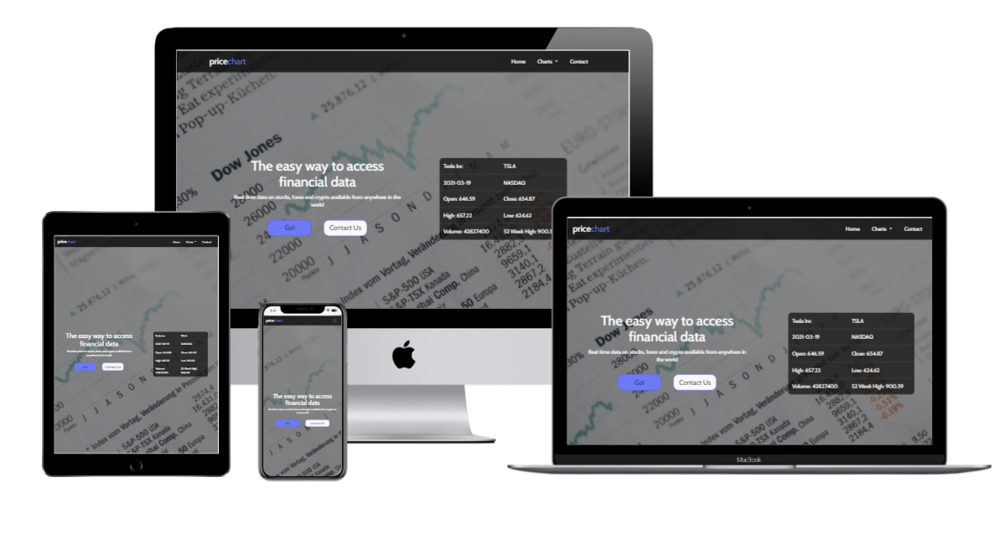

# Website for Price Chart

## Code Institute Milestone Project 2 : Interactive Front End Development

Price Chart is a website designed to provide users with the ability to search for real-time and historical data for stocks, foreign exchange and crypto-currency prices and view this data on a chart. The website will be easy to navigate and the information will be simple to comprehend by users who are familiar with and also those who are not so familiar with financial data. 

A link to the live website can be found [here.](https://shaneoh10.github.io/price-chart-ms2/)

## UX

## Strategy

The price chart website is for users who are looking for real-time and historical data on stocks, foreign exchange and crypto-currency prices.The users may be interested in viewing this data for their own personal reasons like investing or trading, or they may want to view this data for research they may be performing as part of a project for a college course. The website will be simple to navigate and the data will be presented in a clear and easy to read format. As this website will only contain basic stock data it is targeted towards users with less experience with financial data as it may not be suited for experienced traders who are looking for more comprehensive data for their analysis, however, the website will have a professional feel to it and the data will be accurate so it is not strictly limited to beginners. The users of the price chart website will want to see clean and clearly labeled charts (price, date, time, stock name) that will not cause them any confusion with only relevant information being displayed to the user.

#### As a user I want to:
* be able to instinctively navigate the website to efficienty find the required information
* be able to understand what the site is about and how it works
* easily search for and view price charts for stocks, foreign exchange and crypto-currencies
* be able to choose different time intervals on the price charts
* be able to view the website on various devices (mobile, tablet, desktop)
* be able to easily contact price chart with any questions or issues I am have regarding the website
* be easily directed to any social media channels to remain up to date with price chart

## Scope 

After analysing the user stories, I have decided to include the following features as my minimum scope:
* Responsive design
* Information on how the website works
* Individual sections for stocks, crypto-currency and foreign exchange (forex)
* Price charts for each section with buttons to choose time interval of chart
* Contact form
* Social media links in footer

## Structure 

I did some research on other websites that provide stock data and price charts to give me an idea of what users are familiar with. During my research I found that some websites provide a lot of data which may be difficult to understand and can be intimidating to less experienced users. Because of this I decided to design the website in a traditional manner similar to what I found on my research but with just the basic price data in the chart sections so as not to give users an overload of information. The website is designed to be easy to navigate and all information is displayed in a clean manner so that users will have a familiar and enjoyable experience.

I have structuted the website with: 
* A brand logo on the top left with a navbar to the right as is common to most websites
* A collapsible navbar with a hamburger icon for smaller screens
* 5 seperate pages - Home, Stocks, Forex, Crypto, Contact
* Navbar and footer common to all 5 pages
* Social media icons in the footer
* Main content written in bootstrap for responsive design

## Skeleton 

I designed wireframes for mobile, tablet and desktop using Balsamiq. These wireframes can be viewed [here.](https://github.com/shaneoh10/price-chart-ms2/tree/master/assets/documents/wireframes)

## Surface

#### Colours

I chose a neutral colour palette for the website so as not to distract the users from the information that they are looking for. The main buttons and charts are blue which provides a good contrast from the neutral palette and makes it easier for users to find their way around the site and read the chart data.

* #FAFAFA - Cultured (off-white)
* #F8F8F8 - Cultured (off-white)
* #242424 - Eerie Black
* #5086FC - United Nations Blue
* #D6D4D4 - Light Gray
* #286CFD - Ultramarine Blue
* #EBEBEB - Platinum

#### Typography 

I chose 'Cabin' as the font for the project as it is easy to read and it provides users with a sense of professionalism about the website.

## Features 

#### Across all pages:

* The navbar will be visible at the top of the page across all pages of the website. The navbar has the Price Chart logo on the left and there are three navigation items on the right-hand side: Home, Charts & Contact. The Charts item has a dropdown menu with links to travel to three pages: Stocks, Forex & Crypto. The navbar collapses into a hamburger icon on smaller screens.
* The footer will be visible at the bottom of the page across all pages of the website. The footer contains the pricechart logo, a copyright notice, social media links, a navigation menu and a list of contact details. I decided to include all of this information in the footer so that it can be accessed by users from any page of the website and it makes the website feel more professional and legitimate as there is no information being hidden from users.

#### Home page: 

##### Header:
* There is a background image of a newspaper containing charts and financial data. With this high-quality image it will immediately become apparent to users what the subject of the website is and it will give users a first impression of a professional service. The image also ties in with the neutral colour palette chosen for the site.
* A main heading containing the company slogan and sub-heading providing a brief description of the service, quickly draw user attention to this area of the page.
* Two buttons, a Go! call-to-action and a Contact Us button to encourage users to either browse the website and use to the service or contact the company to learn more about the service or raise any issues. The go button is a contrasting blue colour to attract user attention. Both buttons change colour on hover to provide feedback to the user.
* On larger screen sizes there is a table containing real stock data on Tesla Inc which is fetched from an API. This is to show users an example of the type of data that is available on the website.

##### Chart Section:
* This section contains three cards that contain a brief description of each of the financial charts that are available on the website (Stocks, Forex, Crypto) and a button to go to each page. The purpose of this section is to provide users with less of an understanding of the financial markets a bit of information on the charts that they will be looking at.

#### Stocks page: 
* This page contains a description on how to generate a chart, a search bar to enter a stock symbol and four buttons to choose the desired time interval of the chart. The chart is then generated when users press the Go! button next to the search bar. When the user presses the Go button the chart is displayed on the page below the time interval buttons. Below the chart a table containing stock data on the company that the user has searched for is displayed. All data in the chart and table is real data fetched from an API.
* A loading gif is displayed when a chart is being generated to provide users with feedback that the page is loading.
* If the user tries to generate a chart without entering a stock symbol they will be prompted to enter a symbol.
* Any errors that occur when generating a chart will be displayed on screen to the user. (invalid symbol, too many API requests etc.)
* To improve user experience I decided to program the chart to load when the page is opened with a default value (Microsoft Corp) so that users are not greeted with an empty page.

#### Forex page: 
* This page contains a description on how to generate a chart, a dropdown menu to choose a currency pair and four buttons to choose the desired time interval of the chart. The chart is then generated when users press the Go! button next to the search bar. When the user presses the Go button the chart is displayed on the page below the time interval buttons. Below the chart a table containing market data on the currency pair that the user has chosen is displayed. All data in the chart and table is real data fetched from an API.
* A loading gif is displayed when a chart is being generated to provide users with feedback that the page is loading.
* Any errors that occur when generating a chart will be displayed on screen to the user. (invalid symbol, too many API requests etc.)
* To improve user experience I decided to program the chart to load when the page is opened with a default value (EUR/USD) so that users are not greeted with an empty page.

#### Crypto page: 
* This page contains a description on how to generate a chart, a dropdown menu to choose a cryptocurrency and four buttons to choose the desired time interval of the chart. The chart is then generated when users press the Go! button next to the search bar. When the user presses the Go button the chart is displayed on the page below the time interval buttons. Below the chart a table containing market data on the cryptocurrency that the user has chosen is displayed. All data in the chart and table is real data fetched from an API.
* A loading gif is displayed when a chart is being generated to provide users with feedback that the page is loading.
* Any errors that occur when generating a chart will be displayed on screen to the user. (invalid symbol, too many API requests etc.)
* To improve user experience I decided to program the chart to load when the page is opened with a default value (BTC- Bitcoin) so that users are not greeted with a blank page.

#### Contact page: 
* There is a contact form which is set up with email.js so that users can send a message with any questions or concerns they have about the website.
* When the user presses the send button a loader gif is displayed and when the message has successfully sent a message providing that feedback is displayed.
* On larger screens a list of contact details is displayed on screen. The email address and phone number on display have anchors attached to open up your email or phone when clicked to make it easier to get in contact.

## Technologies Used
* HTML5 - This is the main language of the website content
* CSS3 - This is used to style the web pages
* Bootstrap v4.6 - The project uses Bootstrap elements to help with form and design
* JavaScript, jQuery - Used to fetch API data, parse JSON data, implement the functionality of the charts, tables and contact form and other visual effects
* [ScrollReveal](https://scrollrevealjs.org/) - Used for the divs appear on scroll down effect on the home page
* [Chart.js](https://www.chartjs.org/) - Used to generate and display the charts for the website
* [TwelveData](https://twelvedata.com/) - API used to get market data used throughout the website
* GitHub - Used to store the code and host the live website
* Gitpod - This is the IDE I used for the project
* Git - Used within Gitpod as the version control system
* Chrome Developer Tools - Used within Google Chrome to inspect the web pages. This is helpful when designing responsive features and troubleshooting bugs.
* Balsamiq - I created the project wireframes with this software
* Google Fonts - Used to import the font for the project
* [Font Awesome](https://fontawesome.com/) - Used to import icons
* [Techsini](https://techsini.com/) - Used this website to generate the multi-device website mockup

## Testing

Information on testing can be found in [TESTING.md](TESTING.md)

## Deployment

I deployed the Price Chart website on GitHub using the following setup:
1. To set up the initial repository I used the [Code Institute Template.](https://github.com/Code-Institute-Org/gitpod-full-template) I clicked on "use this template" and entered price-chart-ms2 as the repository name and set it to public.
2. In the new coffee box repository I clicked on the GitPod button to open the project up as a new GitPod workspace.
3. Throughout the project I saved all my code to Git by typing `git add .` into the terminal in the GitPod workspace.
4. To commit the code to git I used the command  `git commit -m "add comment here" -a `
5. Using Git I then used the command `git push` to push all the committed code to my GitHub repository at [https://github.com/shaneoh10/price-chart-ms2](https://github.com/shaneoh10/price-chart-ms2)
6. Opened the settings tab in the repository.
7. Scrolled down to "Github Pages" section in settings.
8. Selected "main" branch and "root" folder and pressed "Save" to deploy project to GitHub pages. Website is now live.
9. Clicked on the new link provided to view the live website. [https://shaneoh10.github.io/price-chart-ms2/](https://shaneoh10.github.io/price-chart-ms2/)
10. The live website is automatically updated every time a new commit is pushed to the project repository.

The project can be downloaded as a .zip file by clicking on the "Code" button in the project repository and then clicking "Download ZIP". 

Alternatively the project can be cloned by entering `git clone git@github.com:shaneoh10/price-chart-ms2.git` in the terminal. 

More information on cloning the project can be found [here](https://docs.github.com/en/free-pro-team@latest/github/creating-cloning-and-archiving-repositories/cloning-a-repository).

## Credits 

#### Code:
* The bootstrap navbar was copied from [here](https://getbootstrap.com/docs/4.6/components/navbar/) and edited to suit my project
* The bootstrap time interval radio buttons were copied from [here](https://getbootstrap.com/docs/4.6/components/buttons/) and edited to suit my project
* The bootstrap contact form was copied from [here](https://getbootstrap.com/docs/4.6/components/forms/) and edited to suit my project
* Auto close navbar on click outside navbar - code credit to [this post](https://mdbootstrap.com/support/general/auto-close-navbar-when-click-on-link-responsive-mode/) on mdbootstrap.com. Edited code to suit project.
* Email.js code was copied from Code Institute UCD Resume walkthrough project and edited to suit my project
* Chart.js code to generate chart was copied from [here](https://www.chartjs.org/docs/latest/) and documentation was used to edit chart for my project
* I used the TwelveData API documentation found [here](https://twelvedata.com/docs#getting-started) to implement the correct code for the API requests on my website
* I copied the code and used the documentation found [here](https://scrollrevealjs.org/guide/hello-world.html) to set up the scroll reveal effect on the home page
* Credit to Code Institute's Whiskey Drop walkthrough project for the HTML & CSS I used for the opaque overlay on the home page

#### Photos: 
* Home page - [Unsplash - Markus Spiske @markusspiske](https://unsplash.com/@markusspiske)
* Loader gif - [Icons8.com](https://icons8.com/preloaders)

#### Content: 

The descriptions on the home page were provided by wikipedia.
* [Stock - Wikipedia](https://en.wikipedia.org/wiki/Stock)
* [Forex - Wikipedia](https://en.wikipedia.org/wiki/Foreign_exchange_market)
* [Crypto - Wikipedia](https://en.wikipedia.org/wiki/Cryptocurrency)

All other written content across the website was written by myself.

## Acknowledgements

I would like to thank my mentor Spencer Barriball for his help and guidance throughout the project. I would also like to thank Code Institute and the Slack community for providing me with ideas and inspiration on to how to approach this project.
