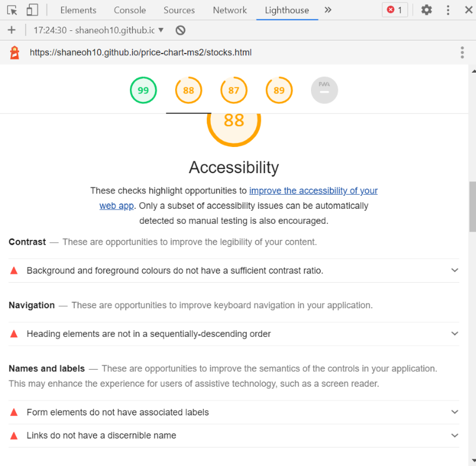
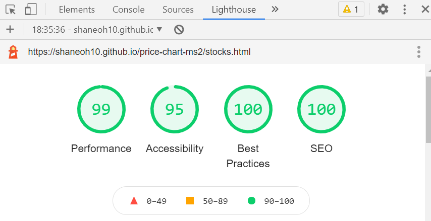
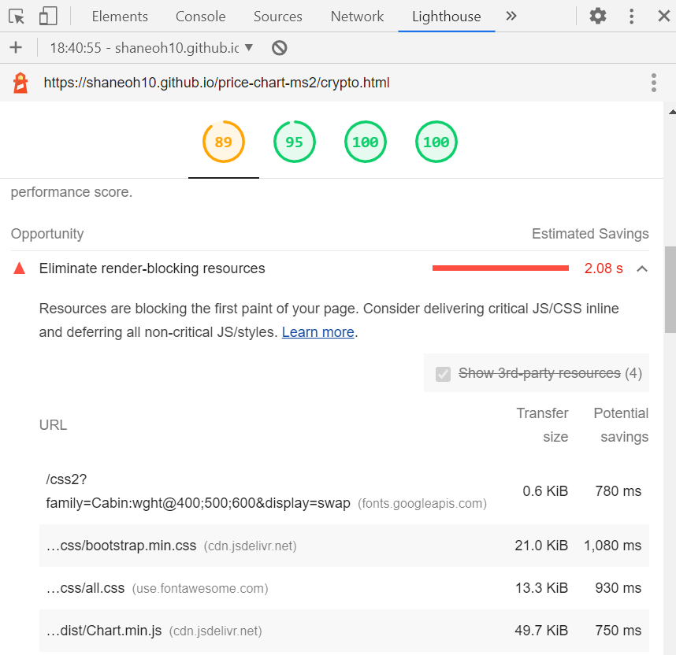
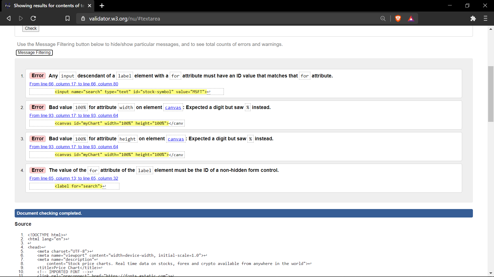
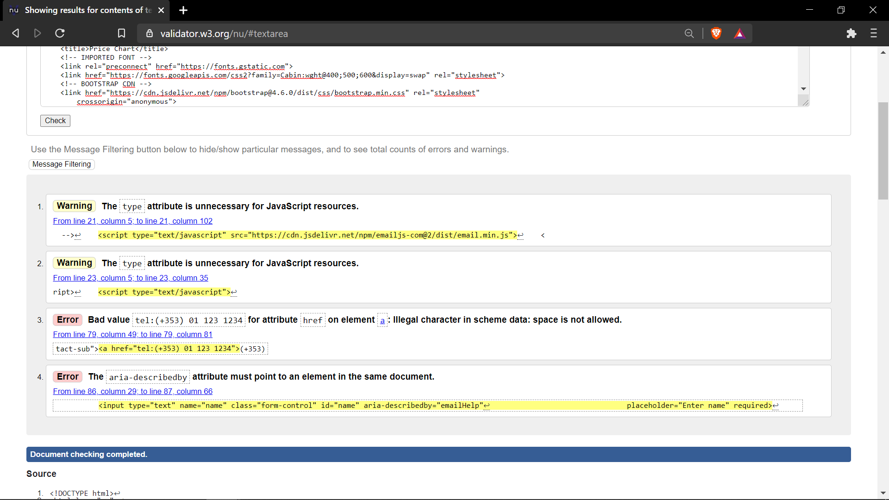
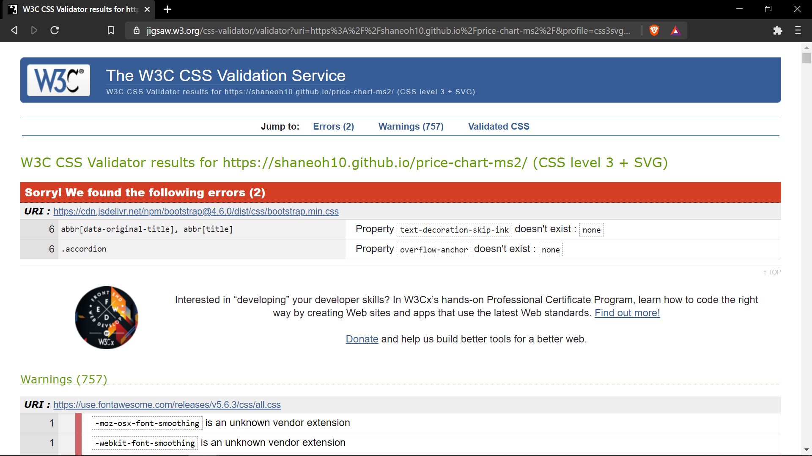
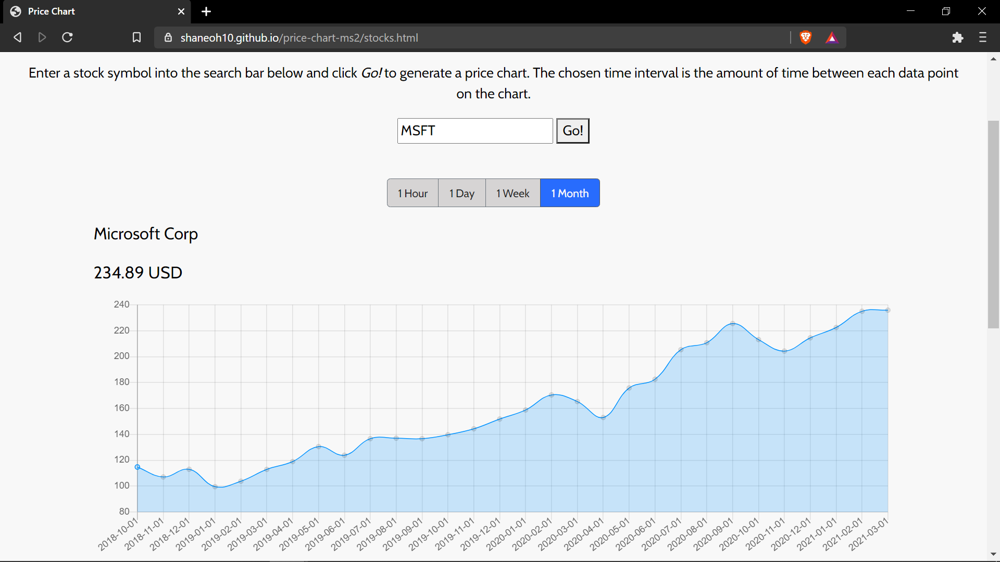
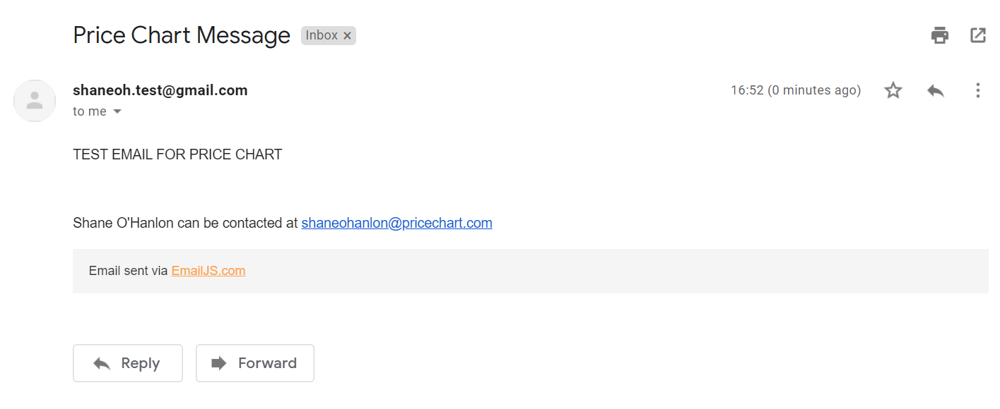
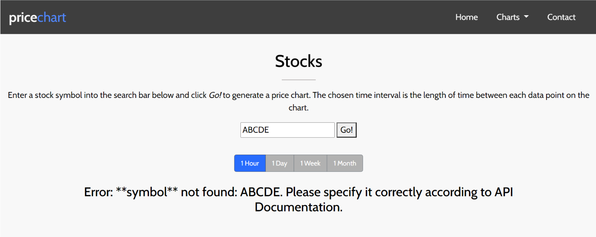

# Price Chart - Testing

[Back to README.md](README.md)

## Chrome Devloper Tools

Throughout the development of the project I used Chrome developer tools to assist with the design when making any changes to HTML and CSS. It is a great tool to assist deciding font sizing, margin, padding etc. before commiting any changes. As it was a mobile first design, by testing with Chrome Developer Tools I was able to add media queries to improve the experience on larger screen sizes. I am happy with how the website turned out I think that it is clear and easy to read on mobile, tablet and desktop devices. Although the website works on all device sizes, I would have to say that it performs better on larger screens as the charts are not as compacted and the data is easier to read.

When I first built the pages with the charts I was having issues with the chart overflowing into the footer. After some testing with Chrome developer tools I found that the issue was that I had set the main section to a fixed height of 100vh which did not allow the section to expand to allow space for the chart and table. By setting the height to min-height 100vh I was able to resolve this issue.

One criticism I have that I found while testing is that with tablet devices (iPad, iPad Pro) there is some whitespace on the contact page due to the aspect ratio of the iPad screens, but overall I am very happy with the project.

#### Lighthouse

I ran tests across all of the pages for desktop and mobile with lighthouse. Here is an example of some of the errors that were found in these tests:

There were errors similar to this found across all the pages and I was able to examine and fix these errors. Below are the results after fixing these errors: 

I ran tests again across all pages for mobile and desktop and although the desktop results all came back ok, there were performance errors present in the mobile tests. An example of these errors is below: 

After examining these errors I decided to take no further action as these are external resources that are causing performance issues and are therefore out of my control.

## Validation

#### W3C Validator

I ran validator tests throughout the project for the HTML and CSS with the W3C Validator. See below some of the errors that were caught.

I investigated and corrected these errors and on the final test there were no errors found for HTML.

When testing the CSS in the validator the following errors were found:

These errors are in the Bootstrap CDN and are therefore out of my control. I ran my own CSS through the validator via direct input and there were no errors found.

#### JSHint

I ran all the JavaScript code through JSHint and I found a few errors which I was able to fix. 

- There were multiple counts of 'missing semicolon' which was easily resolved.
- There was another warning as follows : 'Function declarations should not be placed in blocks. Use a function expression or move the statement to the top of the outer function.' I researched the problem and refactored the code to remove this warning.
- There is another warning that remains present across all JavaScript files: 'template literal syntax is only available in ES6(use esversion:6)'. I found an article on stack overflow [here](https://stackoverflow.com/questions/37247474/es6-in-jshint-jshintrc-has-esversion-but-still-getting-warning-using-atom) that advises by adding `/*jshint esversion: 6 */ ` at the top of the javascript files it would clear this error. I implemented this solution and the errors were no longer present.

## Web Browser and Device Testing

I tested the functionality of the website across a number of browsers and devices to verify that the website is responsive and the code is supported across different browsers.

- Browsers tested:
    - Google Chrome
    - Firefox
    - Brave 
    - Microsoft Edge
    - Samsung Browser

- Devices tested: 
    - Laptop
    - Desktop
    - Samsung Galaxy S20
    - Xiaomi Mi 9

All website features worked across all browsers and devices tested and the website was responsive on all devices.

## Testing User Stories

#### I want to be able to instinctively navigate the website to efficienty find the required information
- As the user scrolls through the page the information is displayed neatly and there are multiple buttons to take the user to the desired section.
- User can instantly go to any page of the website by clicking the link on the navbar.
- If the user scrolls to the bottom of the page there is another menu where the user can click a link to go to any page of the website.

#### I want to be able to understand what the site is about and how it works
- The main heading and sub heading on the home page give the user a brief description of the services provided by the website.
- The charts section on the home page gives users a description of the three markets covered by the website.
- At the top of each chart page(stocks, forex, crypto) there is a guide which tells the user how to generate a price chart.

#### I want to easily search for and view price charts for stocks, foreign exchange and crypto-currencies
- From the home page users are easily directed to the stocks, forex and crypto pages via the navbar or buttons in the charts section.
- On the stocks page there is a search bar where users can enter the stock symbol of their choice and generate a chart.
- On the forex page there is a dropdown menu where the user can choose from a list of popular currency pairs and generate a chart.
- On the crypto page there is a dropdown menu where the user can choose from a list of popular cryptocurrencies and generate a chart.
- I tested the price charts for each page to verify that the search bar and drop down menus work and all are working ok. 
- If no stock symbol is entered into the search bar an error message appears prompting the user to enter a stock symbol, this has been tested and is working.
- Any errors from the API are also displayed on screen to give the user feedback as to why the chart is not working.(incorrect symbol, API call limit etc.) I tested this by entering incorrect symbols and by generating charts in quick succession and it is working ok.

#### I want to be able to choose different time intervals on the price charts
- On each chart page there are four buttons below the search bar or dropdown menu which allow the user to choose a time interval for the chart.
- All time intervals have been tested on each page and are working correctly.

#### I want to be able to view the website on various devices (mobile, tablet, desktop)
- The website has been tested on multiple devices and tested for responsiveness in Chrome developer tools so the users should be able to view the website on a variety of devices.

#### I want to be able to easily contact price chart with any questions or issues I am have regarding the website
- On the contact page the user can fill out form with name, email and their message.
- When the user clicks send to submit the form, form will only send if name field is filled, email is in correct format and message field is filled.
- I have tested and verified the above and also verified that the email is received to my email address as programmed by email.js

#### I want to be easily directed to any social media channels to remain up to date with price chart
- The social media icons are cleary displayed in the footer of the website.
- I tested each icon individually to verify that when clicked it opens up the correct social media website in a new tab.

## Further Testing

### API Testing

#### JSON data
When building the project I wanted to make sure that the data that was being displayed on screen on the charts and tables was correct and as received from the API request. To check this I spent a bit of time making requests for a range of symbols, currency pairs and cryptocurrencies at various time intervals. I also made the same API request in a seperate browser window and compared the values to make sure that the correct values were being displayed on screen in the project. By doing this I was able to verify that I was correctly navigating the JSON data with the javascript functions and presenting the correct information to the website users.

#### Error messages
The website displays an error message on screen to the user if the API request is unsuccessful. By reading the API documentation from [Twelve Data](https://twelvedata.com/) I was able to find out that with the coding I have used to set up the website the main errors that can be induced from the user side are an incorrect symbol and too many API requests. To verify that the correct error messages were being displayed on screen in both of these cases I forced these errors on the website and can confirm that the correct error messages were displayed on screen. 

### Feedback from users
I asked some of my friends to use the website and provide me with feedback on their experience. The feedback they provided was very positive with regards to the website being user friendly and there were no bugs reported. One friend in particular who had no previous exposure to financial data and price charts reported that he was easily able to find his way around the website and generate charts with no issues. This positive feedback from real users is further evidence that the overall goal of the website has been met.